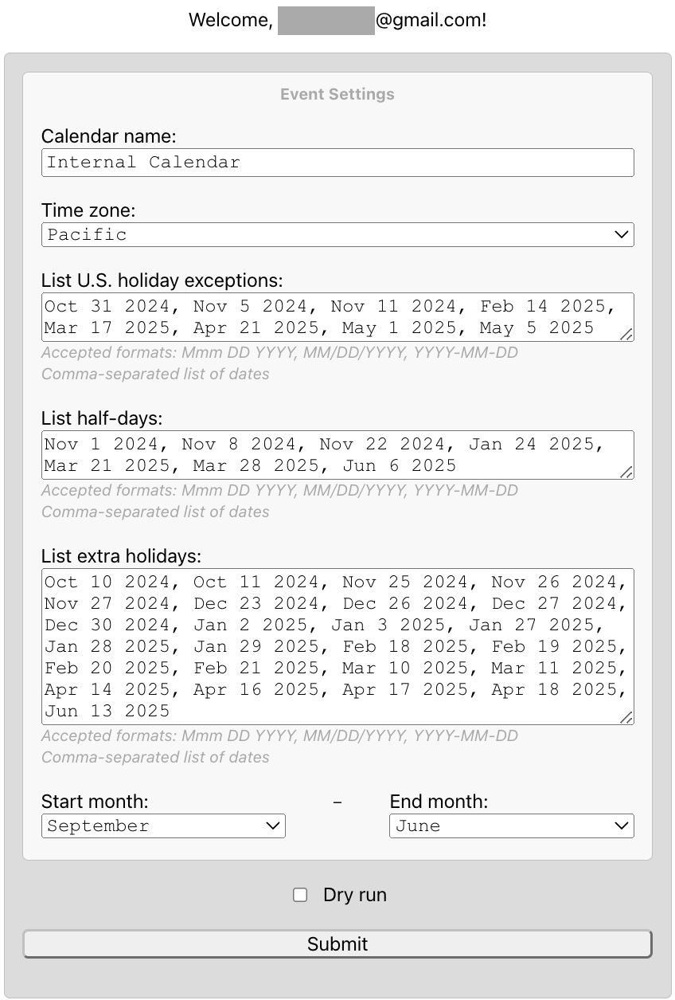
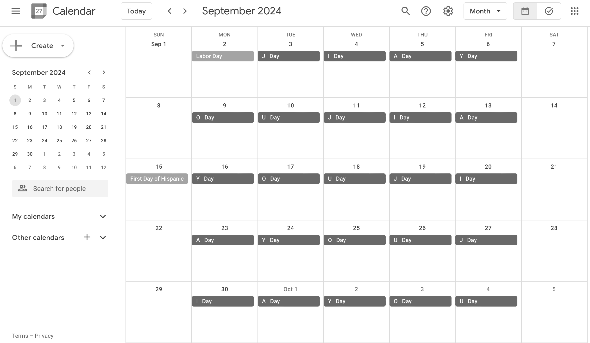
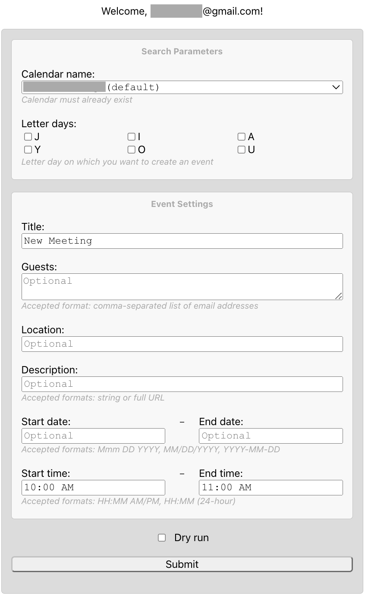
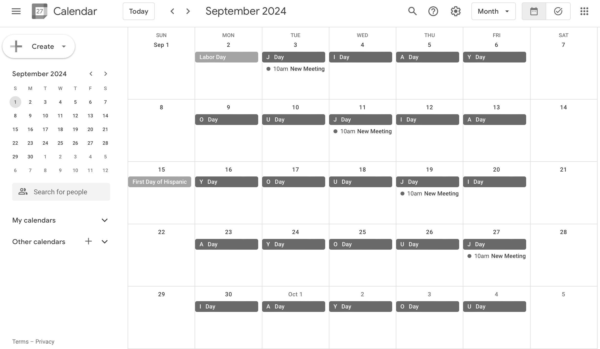
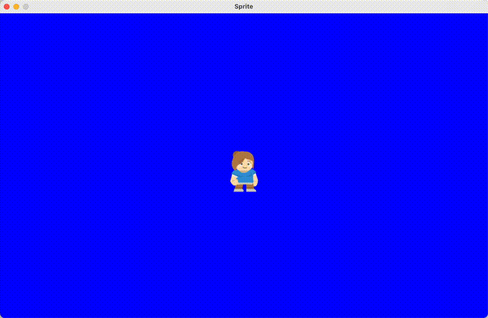

`Hello world!` &#128075;

My name is Ed. I am an educator who also enjoys learning and coding.

Below are some projects of mine, including fun resources, that I would like to highlight. Enjoy!

#### Table of Contents

- [Web Apps &#x2193;](#web_apps)
- [Python Scripts &#x2193;](#python_scripts)
- [Past Projects &#x2193;](#past_projects)
- [Learning Resources &#x2193;](#learning_resources)

## Current Projects

### Web Apps {#web_apps}

Built with JavaScript and HTML

#### Create 加油 ("jiā yóu") Calendar

Google Web app for creating a calendar of recurring events that cycles the words "J Day," "I Day," "A Day," "Y Day," "O Day," and "U Day," except on weekends and holidays. Without an app script, one would need to create these events manually.

##### Visual Example

 

_Note: Meant for limited, internal use. Requires permission to see, edit, share, and permanently delete all the calendars you can access using Google Calendar._

[Get App &#128279;](https://github.com/saegl5/jiayou_create_calendar) &nbsp; &#x2022; &nbsp; [Privacy Policy &#128279;](./jiayou_create_calendar/privacy_policy.html)

#### Add 加油 ("jiā yóu") Events

Google Web app for creating recurring events on only certain letter days (e.g., on only "J Day's"). Without an app script, one would need to add these events manually.

##### Visual Example

 

_Note: Meant for broad, external use. Requires permission to see, edit, share, and permanently delete all the calendars you can access using Google Calendar\*._

[Get App &#128279;](https://github.com/saegl5/jiayou_add_events) &nbsp; &#x2022; &nbsp; [Privacy Policy &#128279;](./jiayou_add_events/privacy_policy.html)

<small>\* Permission is required in order to get calendar information and create event series. That is, to get all calendars, including calendar names and IDs, to get calendar events, including calendar titles, start times, full dates, years, months and days/dates, and to create event series chained by date. However, no personal information from users who interact with the Web app will be collected, stored, or processed by me; users' personal information stays with Google.</small>

### Python Scripts {#python_scripts}

Python script for creating a sprite. It is a starter for Python game development, based on what I learned from teaching computer science for a couple years.

##### Visual Example

[Get Script &#128279;](https://github.com/saegl5/sprite_template)

## Past Projects {#past_projects}

**Python**: [Drawings, animations, and games &#128279;](https://github.com/saegl5/myprojects), [Computing errors for repaying a loan in ten years with minimum monthly payments &#128279;](https://github.com/saegl5/check_student_loans_other_resources/blob/master/Python/Ten-Year_Minimum_Errors.py) 
**Swift**: [iOS app of an experimental study &#128279;](https://github.com/saegl5/check_student_loans_ios) 
**Java**: [Android app of an experimental study &#128279;](https://github.com/saegl5/check_student_loans_android) 
**CSS**: [Light and dark Gitea red theme &#128279;](https://github.com/saegl5/Gitea-Red) 
**_LATEX_**: [Deeper Insight into the iOS App &#128279;](https://github.com/saegl5/check_student_loans_other_resources/blob/master/LaTeX/deeper_insight.tex), [Extra Insight into the iOS App &#128279;](https://github.com/saegl5/check_student_loans_other_resources/blob/master/LaTeX/extra_insight.tex) 
**Google Cloud**: [Hosted Gitea instance in Minimal Ubuntu LTS image &#128279;](https://github.com/saegl5/gitea-gcloud-ubuntu)

(Some additional projects, for example a curriculum and Wiki that I developed, are under a non-disclosure agreement.)

## Learning Resources {#learning_resources}

Disclaimer: These resources are _not_ created, written or published my me. I simply found these to be incredibly useful.

### Scratch and Python for Beginners

[Workman Publishing. (2020). _Everything You Need to Ace Computer Science and Coding in One Big Fat Notebook_. Workman Publishing Company. &#128279;](https://a.co/d/cxwZQEi) 

### Python and Pygame for Continuing Learners

Craven, P. V. (2017). _Program Arcade Games With Python And Pygame_. Programarcadegames.com. [http://programarcadegames.com/index.php?lang=en &#128279;](http://programarcadegames.com/index.php?lang=en)

### Text-Based Coding Practice for All Learners

Edabit. (n.d.). Edabit.com. [https://edabit.com/ &#128279;](https://edabit.com/)
